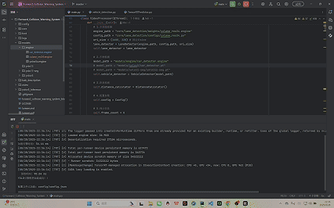

# 前车碰撞预警系统

该系统结合了 UFLD-v2 车道线检测、 YOLO 目标检测、 单/双目测距算法（包括标定、测量、估算、矫正算法），并配备可视化界面。系统支持 Torch 与 TensorRT 推理加速，系统 QT 界面采用多线程、队列存储设计，从而实现了实时性与高精度的性能表现。


## 一. 软件架构

#### 本系统采用模块化设计，主要包含以下核心模块：

- **深度学习框架：** PyTorch + TensorRT（推理加速）

- **计算机视觉：** OpenCV + PIL + Supervision

- **车道线检测：** [Ultra-Fast-Lane-Detection-v2](https://github.com/HHX300/Ultra-Fast-Lane-Detection-v2)

- **目标检测：** YOLOv5/YOLOv7 v8/YOLOv11-seg

- **界面开发：** PyQT  + OpenCV（自定义科技感组件）

- **配置管理：** JSON + Python类封装

  

## 二. 安装教程

#### 1. git项目

```bash
git clone https://github.com/HHX300/forward-collision-warning-system.git
cd forward-collision-warning-system
```

#### 2. 创建虚拟环境

```bash
conda create -n fcw python=3.10
```

#### 3. 激活环境

```bash
conda activate fcw
```

#### 4. 安装依赖

- **安装pytorch依赖**

  ```bash
  # 根据自己电脑的cuda和cpu情况选择相应版本，或者自行pytorch官网下载
  # CUDA 11.8
  pip install torch==2.5.0 torchvision==0.20.0 torchaudio==2.5.0 --index-url https://download.pytorch.org/whl/cu118
  # CUDA 12.1
  pip install torch==2.5.0 torchvision==0.20.0 torchaudio==2.5.0 --index-url https://download.pytorch.org/whl/cu121
  # CUDA 12.4
  pip install torch==2.5.0 torchvision==0.20.0 torchaudio==2.5.0 --index-url https://download.pytorch.org/whl/cu124
  # CPU only
  pip install torch==2.5.0 torchvision==0.20.0 torchaudio==2.5.0 --index-url https://download.pytorch.org/whl/cpu
  ```

- **安装其他相应依赖**

  ```bash
  pip install -r requirements.txt
  
  ```


 ## 三. 使用说明

####  运行程序

```bash
python main.py
```

#### 📌 演示demo


